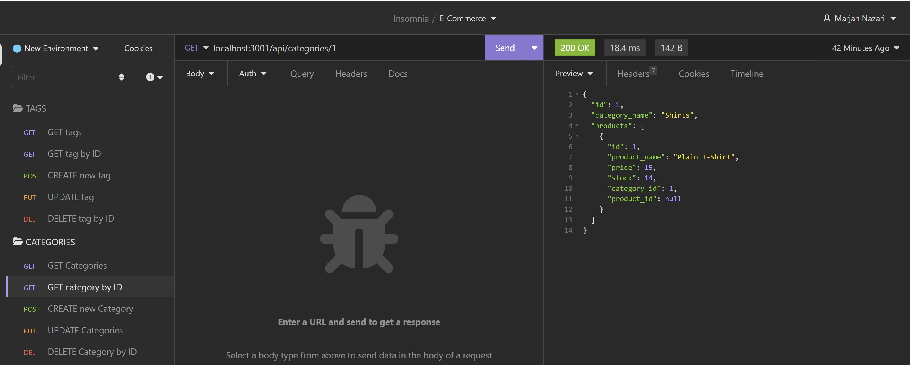
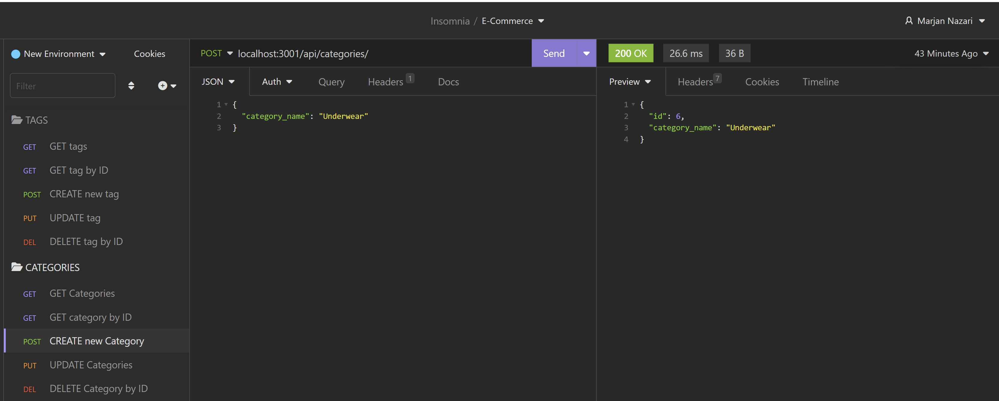
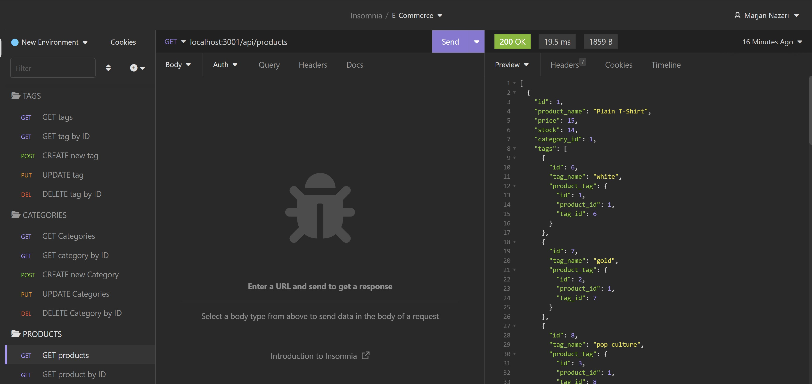

# E-Commerce-BackEnd

## Description
An application to build the back end for an e-commerce site. Working with Express.js API to use Sequelize to interact with a MySQL database.

Internet retail, also known as e-commerce, plays a significant role within the electronics industry, as it empowers businesses and consumers alike to conveniently engage in online buying and selling of electronic products. In the latest available data from 2021, the industry in the United States alone was estimated to have generated the substantial amount of US$2.54 trillion, according to the United Nations Conference on Trade and Development. E-commerce platforms like Shopify and WooCommerce provide a suite of services to businesses of all sizes. Due to the prevalence of these platforms, developers should understand the fundamental architecture of e-commerce sites.

  * [Criteria](#criteria)
  * [Installation](#install)
  * [Usage](#usage)
  * [Mock-Up](#mock-up)

  ## Criteria
```md
GIVEN a functional Express.js API
WHEN I add my database name, MySQL username, and MySQL password to an environment variable file
THEN I am able to connect to a database using Sequelize
WHEN I enter schema and seed commands
THEN a development database is created and is seeded with test data
WHEN I enter the command to invoke the application
THEN my server is started and the Sequelize models are synced to the MySQL database
WHEN I open API GET routes in Insomnia for categories, products, or tags
THEN the data for each of these routes is displayed in a formatted JSON
WHEN I test API POST, PUT, and DELETE routes in Insomnia
THEN I am able to successfully create, update, and delete data in my database
```

## Install

Clone project.
Run the following line of code in your terminal to install all the needed packages: 
```
npm i
```

## Usage

Once all the packages have been installed, open terminal and run the following code in command line : 
```
node server.js
```
This will run the server where you can find the page on localhost:3001. To end your server in your terminal type: control + c

## Mock-Up








